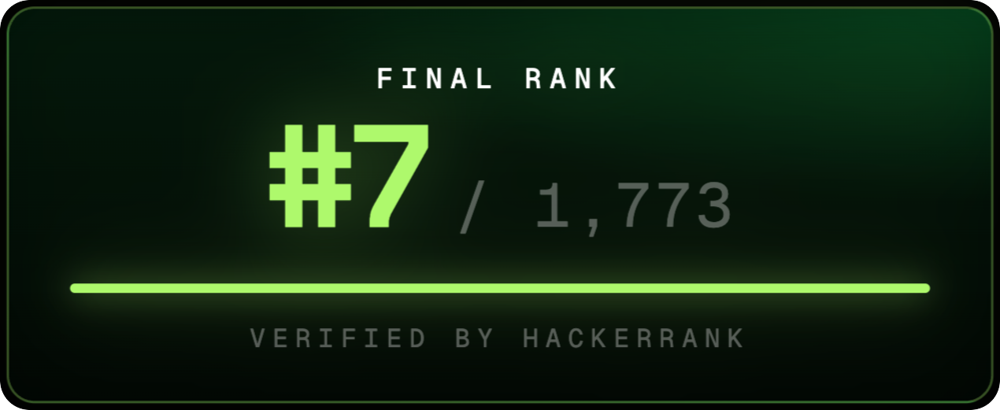
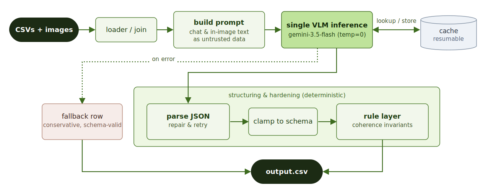

<p align="center">
  <a href="https://www.hackerrank.com/hackerrank-orchestrate-june26"></a>
</p>

<h1 align="center">Multi-Modal Evidence Review</h1>

<p align="center">
  An <strong>orchestration workflow</strong> for verifying damage claims
  (cars, laptops, and packages): it joins submitted images, a support chat transcript,
  user history, and minimum evidence requirements, drives a single
  multimodal LLM call, and turns the raw model output into a reliable,
  schema-valid verdict the model alone doesn't guarantee.
</p>

<p align="center">
  <em>Built for the 24-hour
  <a href="https://www.hackerrank.com/hackerrank-orchestrate-june26">HackerRank Orchestrate</a>
  hackathon.</em>
</p>

<p align="center">
  <a href="https://www.hackerrank.com/contests/hackerrank-orchestrate-june26/challenges/multi-modal-review/leaderboard"></a>
</p>

<p align="center">
  🏆 <strong>7th / 1,773</strong> (Top 0.4%) &nbsp;·&nbsp;
  🎯 <strong>85% accuracy</strong><sup><a href="#results">*</a></sup>
</p>

<p align="center">
  ⚡ single VLM call / claim &nbsp;·&nbsp;
  🧱 deterministic rule layer &nbsp;·&nbsp;
  💾 resumable cache
</p>

<p align="center">
  <a href="https://www.hackerrank.com/contests/hackerrank-orchestrate-june26/challenges/multi-modal-review/leaderboard"><b>Leaderboard →</b></a> &nbsp;·&nbsp;
  <a href="assets/certificate.png"><b>View Full Certificate →</b></a> &nbsp;·&nbsp;
  <a href="https://github.com/interviewstreet/hackerrank-orchestrate-june26"><b>Official Starter Repo →</b></a>
</p>

---

## The Challenge

For each claim, the system receives one or more **submitted images**, a **support chat
transcript**, the user's **claim history**, and the **minimum image evidence
requirements** for that object type. It must decide whether the images *support*,
*contradict*, or provide *not enough information* for the claim, and emit a
schema-valid row of **14 structured fields** (the verdict, its justification, risk
flags, severity, etc.).

The hard part is not the happy path; it's the **adversarial cases**: edited images,
stock-photo watermarks, mismatched image sets, and prompt-injection notes drawn
into the picture, where the conversation cannot be trusted and the image is the
only source of truth.

## My Approach

**Guiding principle:** *images are the source of truth; the conversation only says
what to check; user history is risk context that never overrides clear visual
evidence.* Everything the model is told from the chat or from in-image text is
passed as **untrusted data** behind an explicit **prompt-injection guardrail**.

**A workflow, not an agent.** The task is bounded (a single structured decision per
claim, with no sub-goals to discover at runtime), so it maps to a **deterministic
workflow** rather than an agent that plans its own steps or picks tools. For
this shape, reproducibility, schema guarantees, and cost control matter more than
dynamic control flow, and a workflow delivers all three by construction.

The shipped system makes **one multimodal call to `gemini-3.5-flash` at
`temperature=0`** per claim: the model reads the images *and* the chat transcript and
returns structured JSON. It is a small, low-cost model, not a frontier/pro tier.

<p align="center">
  
</p>

Three ideas carry the system:

- **One multimodal call per claim.** The model sees the images plus a structured prompt
  and returns JSON constrained to the allowed vocabularies. A **clamp** step coerces
  any malformed / out-of-vocab field to a schema-valid value, so output *always*
  passes the evaluator's validators. A second verification call and per-image
  decomposition were both tested and **rejected**: no headline gain for ~2× cost.

- **A deterministic rule layer** for the fields that are *functions of structured
  inputs or of the already-decided verdict*, not independent visual judgments:
  - `evidence_standard_met` ⇔ a verdict was reached
  - `manual_review_required` on a contradicted verdict or a flagged user history
  - `severity = unknown` when the claim can't be assessed

  This was the jump from baseline to shipped (at **zero extra API calls**), and it
  removes every internally incoherent row.

- **Robust, reproducible runs.** An on-disk cache of model responses,
  keyed by `model_id + prompt_version + prompt + image-set`, makes runs resumable (a
  re-run fills only gaps) and re-scoring free. Per-claim isolation means one API failure
  writes a conservative valid row instead of aborting the batch, and 429/5xx retries
  honor the server's suggested `retryDelay`. Every run also writes a `.run.json`
  (model, prompt version, call and cache counts, timing, git commit). Caching and
  fault tolerance give the pipeline **reliability**; the run metadata gives **observability**.

## Results

Development was **eval-driven**: every change was scored on the labeled sample (n=20)
before being kept. There, the shipped system reaches **85% accuracy on the core verdict
(`claim_status`)**, against a **60% majority-class floor**, and produces test-set output
that is **100% schema-valid with 0 internal coherence violations**.

Two choices moved the needle:

- **Model + prompt** lifted the verdict from a 75% first cut to **85%**.
- **A deterministic post-processing layer** (deriving the fields that are functions of
  structured inputs rather than vision) raised the dependent fields (evidence
  sufficiency, risk flags, severity) and eliminated every internally inconsistent
  row, at **zero extra API cost**.

**Operational analysis** (single test pass, n=44): one model call per claim (0 on a
warm cache), 82 images. The cost story is **call discipline**: a second verification
pass and per-image decomposition were both tested and rejected (~2× calls, no headline
gain), the rule layer adds accuracy at **zero extra calls**, and caching makes re-runs
free and resumable. The result is ≈ $0.01 per claim on the shipped model. Full breakdown, including the residual failure-mode analysis (a perceptual
ceiling, and over-trust on adversarial cases), lives in
[`code/evaluation/evaluation_report.md`](./code/evaluation/evaluation_report.md).

## Solution Layout

The solution lives in `code/`:

```text
code/
├── README.md          # Full solution documentation
├── main.py            # Entry point: runs the pipeline over a CSV
├── pipeline.py        # Prompt build, clamp, deterministic rule layer
├── prompts.py         # Versioned prompts (part of the cache key)
├── vlm_client.py      # VLM provider interface (Gemini implemented)
├── schema.py          # Allowed vocabularies + output field schema
├── cache.py           # On-disk response cache (keyed, resumable)
├── requirements.txt   # Python dependencies
├── evaluation/        # Eval harness: scorer, validators, evaluation_report.md
└── docs/              # Methodology trail:
    ├── planning.md        # Task understanding, failure modes, eval spec
    ├── decisions.md       # Why it's built this way (choice / alternative / reason)
    ├── experiment_log.md  # What the data showed (per run: hypothesis, change, result)
    └── results.md         # Scoreboard across configs
```

The `dataset/` (claims, user history, evidence requirements, images) is the provided
input; running the system writes its predictions to `output.csv`.

## Reproducibility

The pipeline is deterministic (`temperature=0`) and runs from a single entry point:
install, set `GEMINI_API_KEY`, and one command writes `output.csv`. An offline `stub`
client exercises the whole pipeline with no API key or cost, and the eval harness scores
any run against the labeled sample. Setup and full flags are in
[`code/README.md`](./code/README.md).
